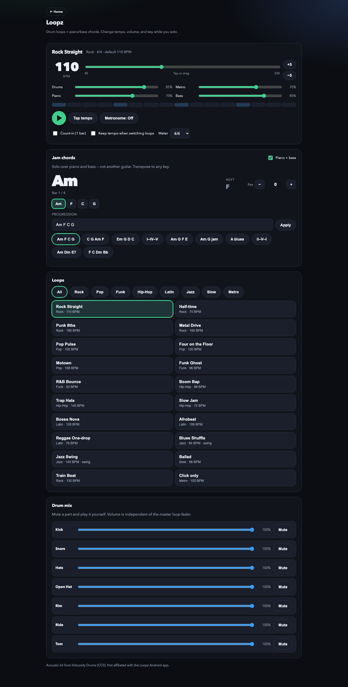

# Practice Stems

Practice app for Mac/Linux: YouTube or local audio/video → Demucs **6-stem** split → live mixer (volume / mute / solo), plus **Loopz** (drum loops + jam chords).

Stems: **vocals, drums, bass, guitar, piano, other** (`htdemucs_6s`).

### Screenshots

Home — YouTube / upload, library, and Loopz:


Stem mixer — Play, BPM / Key, metronome, detect & show chords, record takes, presets, faders:


Presets (Guitarist, Drummer, Singer, …):


Loopz — drum loops, piano/bass jam chords, tempo & key:



---

## Run options

### 1 — Local conda (recommended on Mac: Apple GPU)

Faster than Docker on Apple Silicon. Needs [Miniconda/Anaconda](https://docs.conda.io/).

```bash
cd practice_stems
conda env create -f environment.yml
conda activate practice-stems
python app.py
```

Refresh deps only:

```bash
conda activate practice-stems
pip install -r requirements.txt
```

Open http://127.0.0.1:7860

Needs network for YouTube + first Demucs model download. For HQ slowdown: `brew install rubberband` (CLI on PATH). The `.app` build bundles rubberband.

Optional password (e.g. Cloudflare Tunnel): copy `.env.example` → `.env` and set `APP_PASSWORD`.

### 2 — Docker (portable / CPU)

**Start a Docker engine** (Colima or Docker Desktop). Colima needs **≥ 8 GiB RAM** or Demucs OOMs:

```bash
brew install colima docker
colima start --cpu 4 --memory 8
```

**Run:**

```bash
cd practice_stems
./run-docker.sh
```

Or with Compose (same mounts / cache as the script):

```bash
docker compose up --build
```

Open http://127.0.0.1:7860 — stop with `Ctrl+C`.

| Topic | Detail |
|--------|--------|
| Songs | `./data` → `/app/data` |
| Model cache | `./.cache/torch` |
| Live code | `app.py`, `pipeline/`, `static/` bind-mounted (no rebuild for most edits) |
| GPU | Mac Docker = **CPU only** |

### 3 — macOS .app (Apple Silicon only)

On a Mac that already has the conda env working:

```bash
./scripts/build_macos_app.sh
```

Creates `dist/Practice Stems.app` and `dist/PracticeStems-macos-arm64.dmg`.

On the other Mac (M1–M4): open the DMG → drag to Applications → right-click **Open** (unsigned). First launch unpacks the runtime once. Songs live in `~/Library/Application Support/Practice Stems`.

---

## GitHub Pages demo

Static mixer + Loopz (no Demucs / uploads). Build or refresh:

```bash
python3 scripts/build_gh_pages.py
```

In the repo: **Settings → Pages → Deploy from branch → `/docs`**.

Open `https://<user>.github.io/practice-stems/` — stem demo uses NCS *Fearless pt.II* (see `docs/demo/ATTRIBUTION.md`).

---

## How to use

1. **Home** — paste a YouTube URL or upload audio/video → **Open song**. Clicking a library song opens the **mixer**. **Stop loading** cancels an in-progress open.
2. **Mixer** — stems separate automatically if needed (progress card at top). When ready:
   - Transport: **Play**, **BPM −/+**, **Key −/+**, metronome
   - Chords: **Detect chords**, **Play chords**, **Show chords** (opens the chord list / chart under the transport)
   - ⋯ menu: **Rerun stems**, **Device** (Auto/CPU), **Detect beats** / **Rerun beats**, **Rerun chords**, **Speed**, **HQ speed** (Rubber Band when On)
   - Mixer card: role **presets**, per-stem volume / **Mute** / **Solo**, **Download mix** / **Download stems**
   - **Record** → preview → save under **Takes** (headphones recommended)
3. **Loopz** (from Home) — pick a drum loop, jam chords (piano + bass), tempo / key / metronome; mute kit parts in **Drum mix**.
4. **Delete** (× on a library row) removes a song.

Prefer **0.75×–0.9×** for practice; turn **HQ speed On** when quality matters.

---

## Data layout

```
practice_stems/data/
  play/          # library + MP3s for the mixer
  _incoming/     # downloads + Demucs WAV stems
  _uploads/      # temporary uploads
```

---

## Troubleshooting

| Problem | Fix |
|---------|-----|
| `docker.sock: no such file` | Start Colima or Docker Desktop |
| `docker compose` unknown | Use `./run-docker.sh` |
| Container dies mid-separate | `colima stop && colima start --cpu 4 --memory 8` |
| Port 7860 in use | Stop the other process or map `-p 7861:7860` |
| HQ speed unavailable | `brew install rubberband` (or use the `.app`) |

---

## Requirements files

- `requirements.txt` — local Mac/Linux (includes torch)
- `requirements-docker.txt` — Docker image deps (CPU torch installed in the Dockerfile)
- `environment.yml` — conda env (`ffmpeg` + pip install from `requirements.txt`)
