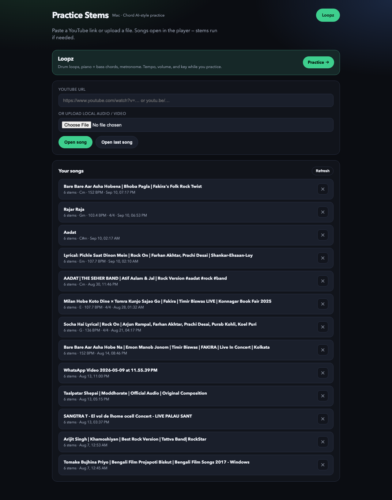
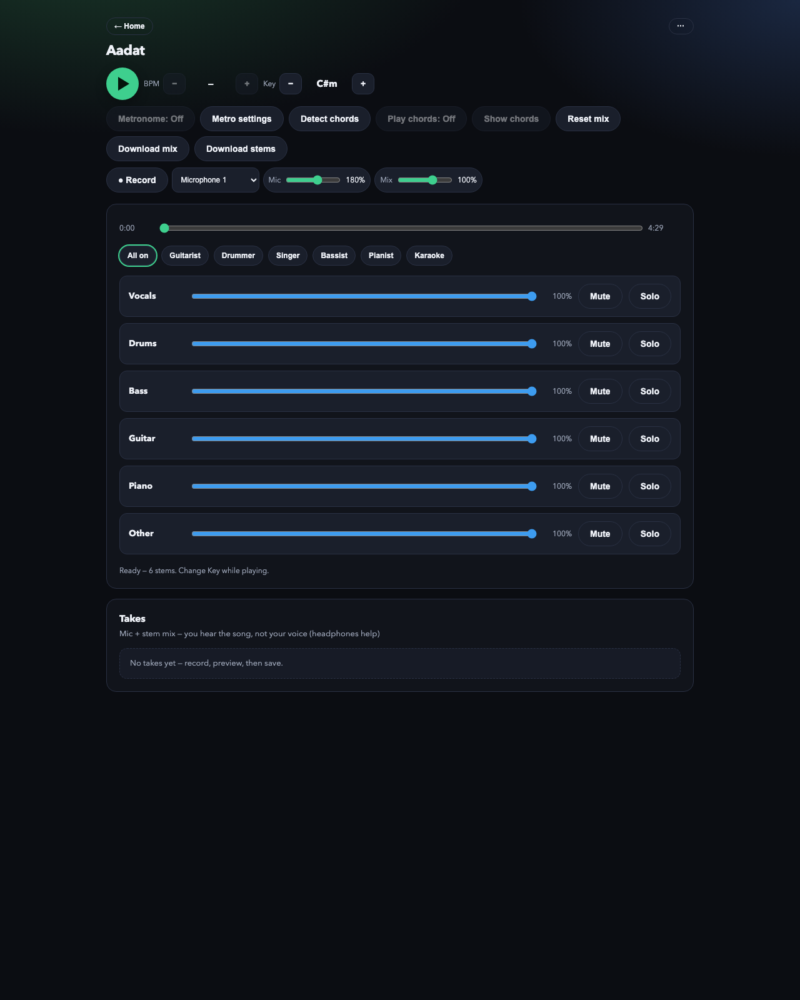
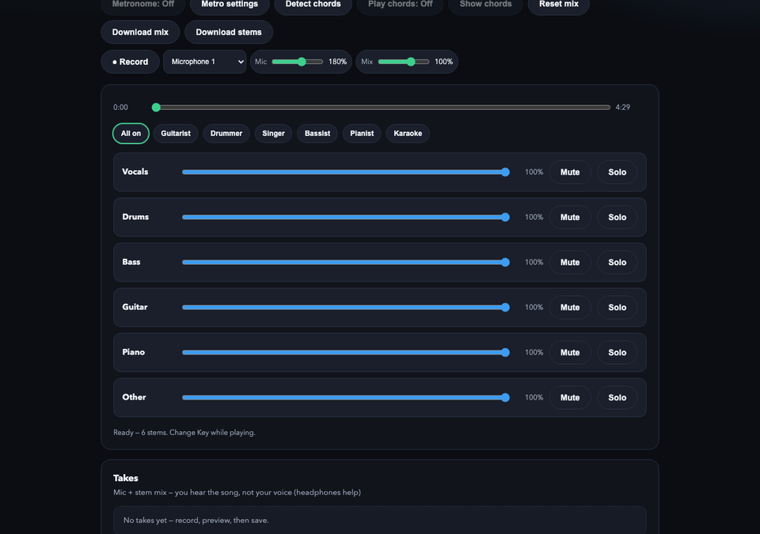

# Practice Stems

Moises-style practice app for Mac/Linux: YouTube or local audio/video → Demucs 6-stem split → live mixer (volume / mute / solo).

Stems: **vocals, drums, bass, guitar, piano, other** (`htdemucs_6s`).

### Screenshots

Home — paste a YouTube URL or upload a file, then open songs from your library:



Stem mixer — Play / seek, role presets, and per-stem volume / mute / solo:



Presets cycling (Guitarist, Drummer, Singer, …):



---

## Option A — Local with conda (recommended on Mac: Apple GPU)

Faster than Docker on Apple Silicon. Needs [Miniconda/Anaconda](https://docs.conda.io/) and Homebrew `ffmpeg`/`rubberband` only if conda packages are missing.

```bash
cd practice_stems
conda env create -f environment.yml
conda activate practice-stems
python app.py
```

If the env already exists and you only need to refresh deps:

```bash
conda activate practice-stems
pip install -r requirements.txt
```

Open http://127.0.0.1:7860

Needs: network for YouTube + first model download. For HQ slowdown: `brew install rubberband` (CLI on PATH).

---

## Option B — Docker (required / portable)

### 1. Start a Docker engine

**Colima (common on Mac without Docker Desktop):**

```bash
brew install colima docker
colima start --cpu 4 --memory 8
```

Use **at least 8 GiB RAM**. With 2 GiB the container will die during separation (OOM).

Check:

```bash
colima list
```

**Or** start Docker Desktop and wait until it’s running.

### 2. Run the app

```bash
cd practice_stems
./run-docker.sh
```

- If an image already exists, choose **Y** to reuse it (app code is bind-mounted from this folder).
- Choose **n** to rebuild the image from scratch.
- If Colima RAM is too low, the script can restart Colima with 4 CPUs / 8 GiB.

Open http://127.0.0.1:7860 — stop with `Ctrl+C`.

Equivalent manual commands:

```bash
docker build -t practice-stems .
docker run --rm -p 7860:7860 \
  -w /app -e PYTHONPATH=/app -e HOST=0.0.0.0 \
  -v "$(pwd)/data:/app/data" \
  -v "$(pwd)/app.py:/app/app.py:ro" \
  -v "$(pwd)/pipeline:/app/pipeline:ro" \
  -v "$(pwd)/static:/app/static:ro" \
  -v "$(pwd)/.cache/torch:/root/.cache/torch" \
  practice-stems
```

### Docker notes

| Topic | Detail |
|--------|--------|
| Songs data | `./data` on your machine → `/app/data` in the container |
| Model cache | `./.cache/torch` (avoids re-downloading Demucs weights) |
| GPU | Docker on Mac = **CPU only**. Linux + NVIDIA can use CUDA later |
| First separate | Slow: downloads model (~50 MB) then processes the whole track |
| Full songs | Leave the terminal open until progress finishes |

---

## How to use the app

1. Paste a **YouTube URL**, or upload **audio / video**, then click **Open song** (download/extract only — no Demucs yet).
2. On the **song hub**: preview the track, then pick an analysis:
   - **Stem separation** → opens the practice mixer when ready
   - **Detect BPM** → tempo estimate
   - **Detect chords** → madmom DeepChroma (maj/min); prefers guitar+piano+other stems
3. In the mixer: **Play**, **Speed**, **HQ speed On/Off** (Off = instant browser stretch; On = Rubber Band, first time may take a bit), faders, **Mute** / **Solo**, presets, **Download mix** / **Download stems**.
   - Prefer **0.75×–0.9×** for practice; turn **HQ speed On** when quality matters.
4. Library **Open** returns to the song hub (not straight to stems).
5. **Stop loading** cancels an in-progress download/open.
6. **Delete** removes a song from the library.

---

## Data layout

```
practice_stems/data/
  play/          # library + MP3s for the mixer
  _incoming/     # downloads + Demucs WAV stems
  _uploads/      # temporary uploads
```

---

## Troubleshooting

| Problem | Fix |
|---------|-----|
| `docker.sock: no such file` | Start Colima (`colima start`) or Docker Desktop |
| `docker compose` unknown | Use `./run-docker.sh` (this install has no Compose plugin) |
| Container dies mid-separate | Raise Colima RAM: `colima stop && colima start --cpu 4 --memory 8` |
| TorchCodec errors | Fixed in current code (uses soundfile + ffmpeg). Restart container / remount |
| Shape / reshape errors | Fixed (no custom Demucs `segment`). Restart `./run-docker.sh` so mounts pick up latest `pipeline/` |
| Port 7860 in use | Stop the other app (`Ctrl+C`) or change host port: `-p 7861:7860` |

---

## Requirements files

- `requirements.txt` — local Mac/Linux (includes current torch)
- `requirements-docker.txt` — Docker image deps (CPU torch installed separately in the Dockerfile)
